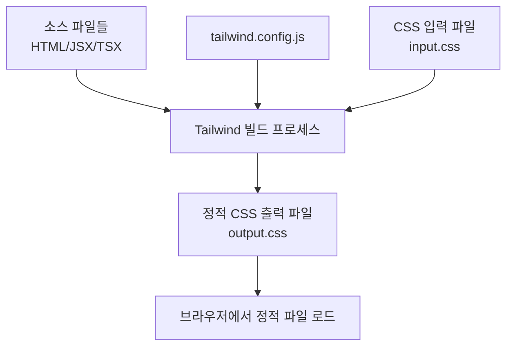

# Tailwind CSS v4.1과 디자인 시스템 구축 완벽 가이드

## 1. Tailwind CSS 이해하기: 핵심 개념과 작동 방식

### 1.1 Utility-First 접근법의 본질

Tailwind CSS는 **Utility-First** 철학을 기반으로 하는 CSS 프레임워크입니다. 전통적인 컴포넌트 기반 CSS와 달리, 각 클래스는 하나의 CSS 속성만을 담당하는 "유틸리티" 역할을 합니다.

```html
<!-- 전통적 접근법 -->
<div class="card"></div>

<!-- Tailwind Utility-First 접근법 -->
<div class="bg-white rounded-lg shadow-md p-6 border"></div>
```

### 1.2 빌드 과정: 어떻게 동작하는가?

**중요한 오해 해소:** Tailwind는 런타임에 JavaScript로 스타일을 처리하지 않습니다.



1. **소스 코드 스캔**: Tailwind는 프로젝트 내 모든 템플릿 파일을 분석
2. **유틸리티 추출**: 실제로 사용된 Utility 클래스만 식별
3. **CSS 생성**: 추출된 클래스들에 해당하는 CSS만 포함된 정적 파일 생성
4. **배포**: 생성된 CSS 파일이 HTML에 링크되어 브라우저에서 로드

## 2. Tailwind v4.1의 혁명: CSS First Approach

### 2.1 v3 vs v4: 패러다임의 전환

**Tailwind v3의 한계:**
- 복잡해지는 `tailwind.config.js`
- 완전한 온디맨드 빌드의 어려움
- CSS 표준과의 격차

**Tailwind v4의 해결책:**
```css
/* v3: JavaScript 설정 */
// tailwind.config.js
module.exports = {
  theme: {
    extend: {
      colors: {
        brand: {
          500: '#3b82f6',
        }
      }
    }
  }
}

/* v4: CSS First Approach */
/* globals.css */
@import "tailwindcss";

@theme {
  --color-brand-500: oklch(0.62 0.19 250);
}
```

### 2.2 CSS First Approach의 핵심 이점

1. **표준 준수**: CSS 변수와 최신 CSS 표준 활용
2. **성능 향상**: 더 정확한 온디맨드 빌드
3. **개발자 경험**: DevTools에서 직접 변수 확인 가능
4. **유연성**: CSS의 전체 기능 활용

## 3. Tailwind v4.1의 레이어 시스템 심화 이해

### 3.1 `@layer base` - 기본 스타일 재설정 계층

**목적**: HTML 요소의 기본 스타일을 재정의하고 전역 변수를 정의

```css
@layer base {
  /* CSS 변수 전역 정의 */
  :root {
    --color-background: 0 0% 100%;
    --color-foreground: 222.2 84% 4.9%;
    --color-primary: 222.2 47.4% 11.2%;
  }

  /* 다크 모드 변수 */
  @media (prefers-color-scheme: dark) {
    :root {
      --color-background: 222.2 84% 4.9%;
      --color-foreground: 210 40% 98%;
    }
  }

  /* HTML 요소 기본 스타일 */
  html {
    scroll-behavior: smooth;
  }

  body {
    font-feature-settings: "rlig" 1, "calt" 1;
  }

  h1, h2, h3, h4, h5, h6 {
    text-wrap: balance;
  }

  /* 사용자 정의 폰트 */
  @font-face {
    font-family: 'Geist Sans';
    src: url('/fonts/Geist-Sans.woff2') format('woff2');
    font-weight: 100 900;
    font-display: swap;
  }
}
```

### 3.2 `@layer components` - 재사용 컴포넌트 계층

**목적**: 버튼, 카드, 네비게이션 등 재사용 가능한 UI 컴포넌트 정의

```css
@layer components {
  /* 버튼 컴포넌트 시스템 */
  .btn {
    @apply inline-flex items-center justify-center gap-2 whitespace-nowrap rounded-md text-sm font-medium transition-all;
    @apply focus-visible:outline-none focus-visible:ring-2 focus-visible:ring-offset-2;
    @apply disabled:pointer-events-none disabled:opacity-50;
  }

  .btn-primary {
    @apply bg-brand-600 text-white hover:bg-brand-700 focus-visible:ring-brand-600;
  }

  .btn-secondary {
    @apply bg-gray-100 text-gray-900 hover:bg-gray-200 focus-visible:ring-gray-500;
  }

  .btn-outline {
    @apply border border-gray-300 bg-transparent hover:bg-gray-50 focus-visible:ring-gray-500;
  }

  /* 카드 컴포넌트 변형 */
  .card {
    @apply rounded-lg border bg-white shadow-sm;
  }

  .card-header {
    @apply flex flex-col space-y-1.5 p-6;
  }

  .card-title {
    @apply text-2xl font-semibold leading-none tracking-tight;
  }

  .card-content {
    @apply p-6 pt-0;
  }

  /* 폼 컴포넌트 */
  .input {
    @apply flex h-10 w-full rounded-md border border-gray-300 bg-white px-3 py-2;
    @apply text-sm placeholder:text-gray-400;
    @apply focus:outline-none focus:ring-2 focus:ring-brand-600 focus:ring-offset-2;
    @apply disabled:cursor-not-allowed disabled:opacity-50;
  }

  /* 네비게이션 */
  .nav-item {
    @apply flex items-center text-sm font-medium text-gray-600 transition-colors hover:text-gray-900;
  }

  .nav-item-active {
    @apply text-gray-900 bg-gray-100;
  }
}
```

### 3.3 `@layer utilities` - 사용자 정의 유틸리티 계층

**목적**: Tailwind에 없는 새로운 Utility 클래스 생성

```css
@layer utilities {
  /* 스크롤바 유틸리티 */
  .scrollbar-thin {
    scrollbar-width: thin;
  }
  
  .scrollbar-thumb-gray-300 {
    scrollbar-color: rgb(209 213 219) transparent;
  }

  /* 텍스트 밸런스 */
  .text-balance {
    text-wrap: balance;
  }

  /* 그라디언트 */
  .bg-gradient-brand {
    background: linear-gradient(135deg, 
      hsl(var(--color-brand-500)), 
      hsl(var(--color-brand-600))
    );
  }

  /* 애니메이션 */
  .animate-in {
    animation-duration: 150ms;
    animation-timing-function: cubic-bezier(0.4, 0, 0.2, 1);
  }

  .fade-in-0 {
    animation-name: fadeIn;
    animation-fill-mode: both;
  }

  @keyframes fadeIn {
    from {
      opacity: 0;
      transform: translateY(10px);
    }
    to {
      opacity: 1;
      transform: translateY(0);
    }
  }

  /* 반응형 유틸리티 */
  @variants hover, focus {
    .scale-105 {
      transform: scale(1.05);
    }
  }

  /* 다크 모드 유틸리티 */
  @media (prefers-color-scheme: dark) {
    .dark\:invert {
      filter: invert(1);
    }
  }
}
```

## 4. v4.1의 새로운 기능: `:root`와 `@theme inline`

### 4.1 `:root {}` - 전역 CSS 변수 정의

**목적**: 전체 애플리케이션에서 사용되는 전역 디자인 토큰 정의

```css
@layer base {
  :root {
    /* Color System - OKLCH for better perceptual uniformity */
    --color-background: 0 0% 100%;
    --color-foreground: 222.2 84% 4.9%;
    
    /* Primary Colors */
    --color-primary: 222.2 47.4% 11.2%;
    --color-primary-foreground: 210 40% 98%;
    
    /* Brand Colors */
    --color-brand-50: oklch(0.97 0.01 250);
    --color-brand-100: oklch(0.95 0.02 250);
    --color-brand-500: oklch(0.62 0.19 250);
    --color-brand-600: oklch(0.55 0.20 250);
    --color-brand-900: oklch(0.25 0.15 250);
    
    /* Semantic Colors */
    --color-success: 142 76% 36%;
    --color-warning: 38 92% 50%;
    --color-error: 0 84% 60%;
    
    /* Typography Scale */
    --font-size-xs: 0.75rem;
    --font-size-sm: 0.875rem;
    --font-size-base: 1rem;
    --font-size-lg: 1.125rem;
    --font-size-xl: 1.25rem;
    
    /* Spacing Scale */
    --spacing-1: 0.25rem;
    --spacing-2: 0.5rem;
    --spacing-4: 1rem;
    --spacing-6: 1.5rem;
    
    /* Border Radius */
    --radius-sm: 0.125rem;
    --radius-md: 0.375rem;
    --radius-lg: 0.5rem;
    
    /* Shadows */
    --shadow-sm: 0 1px 2px 0 rgb(0 0 0 / 0.05);
    --shadow-md: 0 4px 6px -1px rgb(0 0 0 / 0.1);
    
    /* Z-index Scale */
    --z-dropdown: 1000;
    --z-modal: 2000;
    --z-toast: 3000;
  }

  /* 다크 모드 변수 오버라이드 */
  @media (prefers-color-scheme: dark) {
    :root {
      --color-background: 222.2 84% 4.9%;
      --color-foreground: 210 40% 98%;
      --color-primary: 210 40% 98%;
      --color-primary-foreground: 222.2 47.4% 11.2%;
    }
  }
}
```

### 4.2 `@theme inline {}` - 인라인 테마 확장

**목적**: 기존 테마를 확장하거나 컴포넌트 스코프 내에서 테마 변수 재정의

```css
/* 방법 1: 글로벌 테마 확장 */
@theme inline {
  /* 브랜드별 확장 색상 */
  --color-accent-500: oklch(0.65 0.22 160);
  --color-premium-500: oklch(0.58 0.25 30);
  
  /* 확장 타이포그래피 */
  --font-family-mono: 'JetBrains Mono', monospace;
  --font-size-hero: 4rem;
  --line-height-hero: 1;
  
  /* 커스텀 간격 */
  --spacing-section: 6rem;
  --spacing-gutter: 2rem;
  
  /* 고급 그림자 */
  --shadow-glow: 0 0 50px -12px oklch(0.62 0.19 250 / 0.25);
}

/* 방법 2: 컴포넌트 스코프 테마 */
.card-premium {
  @theme inline {
    --color-surface: oklch(0.98 0.01 250);
    --color-border: oklch(0.9 0.05 250);
    --shadow-card: var(--shadow-glow);
  }
  
  background: var(--color-surface);
  border: 1px solid var(--color-border);
  box-shadow: var(--shadow-card);
}
```

## 5. AI 생성 React 앱을 Tailwind v4.1로 전환하는 실전 가이드

### 5.1 현황 분석 및 준비

**일반적인 AI 생성 코드의 문제점:**
```jsx
// AI가 생성한 전형적인 v3 방식 코드
function OldCard() {
  return (
    <div className="bg-white rounded-lg shadow-md p-4">
      <h3 className="text-lg font-semibold text-gray-800">Title</h3>
      <p className="text-gray-600 mt-2">Content</p>
    </div>
  );
}
```

**v4.1로의 전환 전략:**
1. `globals.css` 파일 생성 및 기본 설정
2. 점진적인 컴포넌트 시스템 구축
3. 디자인 토큰 체계화
4. 유틸리티 클래스 최적화

### 5.2 단계별 전환 과정

#### 1단계: 기본 설정 파일 생성

```css
/* globals.css - v4.1 기본 설정 */
@import "tailwindcss";

/* 전역 디자인 토큰 */
@layer base {
  :root {
    /* 색상 시스템 */
    --color-background: 0 0% 100%;
    --color-foreground: 222.2 84% 4.9%;
    --color-muted: 210 40% 98%;
    --color-muted-foreground: 215.4 16.3% 46.9%;
    
    /* 브랜드 색상 - OKLCH 사용 */
    --color-primary-50: oklch(0.98 0.01 250);
    --color-primary-100: oklch(0.95 0.02 250);
    --color-primary-500: oklch(0.62 0.19 250);
    --color-primary-600: oklch(0.55 0.20 250);
    --color-primary-900: oklch(0.25 0.15 250);
    
    /* 회색 스케일 */
    --color-gray-50: oklch(0.985 0.002 247.858);
    --color-gray-100: oklch(0.967 0.003 264.542);
    --color-gray-500: oklch(0.551 0.027 264.364);
    --color-gray-900: oklch(0.21 0.034 264.665);
    
    /* 간격 시스템 */
    --spacing-1: 0.25rem;
    --spacing-2: 0.5rem;
    --spacing-3: 0.75rem;
    --spacing-4: 1rem;
    --spacing-6: 1.5rem;
    --spacing-8: 2rem;
    
    /* 타이포그래피 */
    --font-family-sans: 'Inter', 'system-ui', 'sans-serif';
    --font-size-sm: 0.875rem;
    --font-size-base: 1rem;
    --font-size-lg: 1.125rem;
    --font-size-xl: 1.25rem;
    
    /* 둥근 모서리 */
    --radius-sm: 0.125rem;
    --radius: 0.375rem;
    --radius-lg: 0.5rem;
    --radius-xl: 0.75rem;
  }

  /* 기본 요소 스타일 */
  html {
    font-family: var(--font-family-sans);
  }
  
  body {
    background-color: hsl(var(--color-background));
    color: hsl(var(--color-foreground));
  }
  
  h1, h2, h3, h4, h5, h6 {
    font-weight: 600;
    line-height: 1.25;
  }
}

/* 테마 확장 */
@theme inline {
  --color-brand: var(--color-primary-500);
  --color-brand-muted: var(--color-primary-100);
  --spacing-section: 5rem;
  --spacing-gutter: 1.5rem;
}
```

#### 2단계: 컴포넌트 시스템 구축

```css
/* globals.css - 컴포넌트 계층 추가 */
@layer components {
  /* 레이아웃 컴포넌트 */
  .container-custom {
    @apply mx-auto max-w-7xl px-gutter;
  }
  
  .section-spacing {
    @apply py-section;
  }
  
  /* 카드 컴포넌트 시스템 */
  .card {
    @apply rounded-xl border bg-white shadow-sm;
  }
  
  .card-header {
    @apply flex flex-col space-y-1.5 p-6;
  }
  
  .card-title {
    @apply font-semibold leading-none tracking-tight;
  }
  
  .card-description {
    @apply text-sm text-muted-foreground;
  }
  
  .card-content {
    @apply p-6 pt-0;
  }
  
  .card-footer {
    @apply flex items-center p-6 pt-0;
  }
  
  /* 버튼 컴포넌트 시스템 */
  .btn {
    @apply inline-flex items-center justify-center gap-2 whitespace-nowrap rounded-md text-sm font-medium;
    @apply transition-all focus-visible:outline-none focus-visible:ring-2 focus-visible:ring-offset-2;
    @apply disabled:pointer-events-none disabled:opacity-50;
    min-height: 2.5rem;
    padding: 0.5rem 1rem;
  }
  
  .btn-primary {
    @apply bg-brand text-white hover:bg-primary-600 focus-visible:ring-primary-500;
  }
  
  .btn-secondary {
    @apply bg-gray-100 text-gray-900 hover:bg-gray-200 focus-visible:ring-gray-500;
  }
  
  .btn-outline {
    @apply border border-gray-300 bg-transparent hover:bg-gray-50 focus-visible:ring-gray-500;
  }
  
  .btn-ghost {
    @apply bg-transparent hover:bg-gray-100 focus-visible:ring-gray-500;
  }
  
  /* 폼 컴포넌트 */
  .input {
    @apply flex h-10 w-full rounded-md border border-gray-300 bg-white px-3 py-2;
    @apply text-sm placeholder:text-gray-400;
    @apply focus:outline-none focus:ring-2 focus:ring-brand focus:ring-offset-2;
    @apply disabled:cursor-not-allowed disabled:opacity-50;
  }
  
  .label {
    @apply text-sm font-medium leading-none peer-disabled:cursor-not-allowed peer-disabled:opacity-70;
  }
}
```

#### 3단계: 유틸리티 확장

```css
@layer utilities {
  /* 텍스트 밸런스 */
  .text-balance {
    text-wrap: balance;
  }
  
  /* 스크롤바 유틸리티 */
  .scrollbar-thin {
    scrollbar-width: thin;
    scrollbar-color: hsl(var(--color-gray-300)) transparent;
  }
  
  .scrollbar-thin::-webkit-scrollbar {
    width: 6px;
  }
  
  .scrollbar-thin::-webkit-scrollbar-track {
    background: transparent;
  }
  
  .scrollbar-thin::-webkit-scrollbar-thumb {
    background: hsl(var(--color-gray-300));
    border-radius: 3px;
  }
  
  /* 그라디언트 */
  .bg-gradient-brand {
    background: linear-gradient(135deg, 
      hsl(var(--color-primary-500)), 
      hsl(var(--color-primary-600))
    );
  }
  
  /* 애니메이션 */
  .animate-in {
    animation-duration: 150ms;
    animation-timing-function: cubic-bezier(0.4, 0, 0.2, 1);
  }
  
  .fade-in {
    animation-name: fadeIn;
  }
  
  .slide-in-from-bottom {
    animation-name: slideInFromBottom;
  }
  
  @keyframes fadeIn {
    from { opacity: 0; }
    to { opacity: 1; }
  }
  
  @keyframes slideInFromBottom {
    from {
      opacity: 0;
      transform: translateY(10px);
    }
    to {
      opacity: 1;
      transform: translateY(0);
    }
  }
}
```

### 5.3 Next.js 애플리케이션에 적용

```jsx
// layout.js - Next.js 레이아웃
import './globals.css'

export const metadata = {
  title: 'My v4.1 App',
  description: 'Tailwind CSS v4.1로 구축된 현대적 애플리케이션',
}

export default function RootLayout({ children }) {
  return (
    <html lang="ko">
      <body className="min-h-screen bg-background font-sans antialiased">
        {children}
      </body>
    </html>
  )
}
```

```jsx
// page.js - 개선된 컴포넌트 사용
export default function HomePage() {
  return (
    <div className="container-custom">
      {/* 헤로 섹션 */}
      <section className="section-spacing text-center">
        <h1 className="text-4xl font-bold tracking-tight text-balance">
          Tailwind v4.1 디자인 시스템
        </h1>
        <p className="mt-4 text-lg text-muted-foreground max-w-2xl mx-auto text-balance">
          CSS First Approach로 구축된 현대적이고 확장 가능한 디자인 시스템
        </p>
        
        <div className="mt-8 flex gap-4 justify-center">
          <button className="btn btn-primary">
            시작하기
          </button>
          <button className="btn btn-outline">
            자세히 알아보기
          </button>
        </div>
      </section>
      
      {/* 카드 그리드 */}
      <section className="section-spacing">
        <div className="grid grid-cols-1 md:grid-cols-2 lg:grid-cols-3 gap-6">
          <Card 
            title="성능 최적화" 
            description="온디맨드 빌드로 최적화된 CSS 번들"
          />
          <Card 
            title="CSS 표준 준수" 
            description="최신 CSS 표준과 변수를 활용"
          />
          <Card 
            title="개발자 경험" 
            description="향상된 개발자 도구 통합"
          />
        </div>
      </section>
    </div>
  )
}

// 재사용 가능한 카드 컴포넌트
function Card({ title, description }) {
  return (
    <div className="card group hover:shadow-md transition-shadow">
      <div className="card-header">
        <h3 className="card-title">{title}</h3>
      </div>
      <div className="card-content">
        <p className="card-description">{description}</p>
      </div>
    </div>
  )
}
```

## 6. 디자인 시스템 확장 및 유지보수 전략

### 6.1 디자인 토큰 관리

```css
/* design-tokens.css - 토큰 분리 관리 */
@layer base {
  :root {
    /* 색상 역할 정의 */
    --color-bg-primary: var(--color-background);
    --color-bg-secondary: var(--color-muted);
    --color-text-primary: var(--color-foreground);
    --color-text-secondary: var(--color-muted-foreground);
    
    /* 상태 색상 */
    --color-state-success: 142 76% 36%;
    --color-state-warning: 38 92% 50%;
    --color-state-error: 0 84% 60%;
    --color-state-info: 221 83% 53%;
    
    /* 상호작용 상태 */
    --color-hover: var(--color-primary-100);
    --color-active: var(--color-primary-200);
    --color-focus: var(--color-primary-500);
    
    /* 테두리 */
    --color-border-primary: var(--color-gray-300);
    --color-border-secondary: var(--color-gray-200);
  }
}
```

### 6.2 컴포넌트 변형 시스템

```css
@layer components {
  /* 버튼 크기 변형 */
  .btn-sm {
    @apply h-8 px-3 text-xs;
  }
  
  .btn-lg {
    @apply h-12 px-8 text-base;
  }
  
  /* 버튼 색상 변형 */
  .btn-success {
    @apply bg-state-success text-white hover:bg-state-success/90 focus-visible:ring-state-success;
  }
  
  .btn-warning {
    @apply bg-state-warning text-white hover:bg-state-warning/90 focus-visible:ring-state-warning;
  }
  
  .btn-error {
    @apply bg-state-error text-white hover:bg-state-error/90 focus-visible:ring-state-error;
  }
  
  /* 카드 변형 */
  .card-elevated {
    @apply shadow-lg border-0;
  }
  
  .card-interactive {
    @apply cursor-pointer transition-all hover:shadow-md hover:translate-y-[-2px];
  }
}
```

### 6.3 다크 모드 지원

```css
@layer base {
  @media (prefers-color-scheme: dark) {
    :root {
      --color-background: 222.2 84% 4.9%;
      --color-foreground: 210 40% 98%;
      --color-muted: 217.2 32.6% 17.5%;
      --color-muted-foreground: 215 20.2% 65.1%;
      --color-border-primary: hsl(217.2 32.6% 17.5%);
    }
  }
}

@layer utilities {
  /* 다크 모드 유틸리티 */
  @media (prefers-color-scheme: dark) {
    .dark\:invert {
      filter: invert(1);
    }
    
    .dark\:bg-surface-elevated {
      background: hsl(var(--color-muted));
    }
  }
}
```

## 7. 마이그레이션 체크리스트 및 모범 사례

### 7.1 점진적 마이그레이션 체크리스트

- [ ] `globals.css`에 v4.1 기본 설정 추가
- [ ] 기존 Utility 클래스 작동 확인
- [ ] 디자인 토큰(`:root`) 정의
- [ ] 기본 컴포넌트 시스템 구축(`@layer components`)
- [ ] 커스텀 유틸리티 추가(`@layer utilities`)
- [ ] 테마 확장(`@theme inline`) 적용
- [ ] 다크 모드 지원 구현
- [ ] 성능 및 번들 크기 검증

### 7.2 모범 사례

1. **점진적 개선**: 한 번에 모든 것을 변경하지 말고 컴포넌트 단위로 개선
2. **의미 있는 네이밍**: `--color-primary-500` 대신 `--color-action-primary` 같은 의미론적 이름 사용
3. **일관된 스케일**: 간격, 색상, 타이포그래피에 일관된 스케일 적용
4. **문서화**: 디자인 토큰과 컴포넌트 사용법을 팀과 공유
5. **성능 모니터링**: 빌드 시간과 번들 크기를 정기적으로 확인

이 체계적인 접근법을 통해 AI가 생성한 레거시 코드를 현대적이고 확장 가능한 Tailwind v4.1 기반 디자인 시스템으로 성공적으로 전환할 수 있습니다.